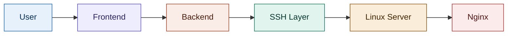
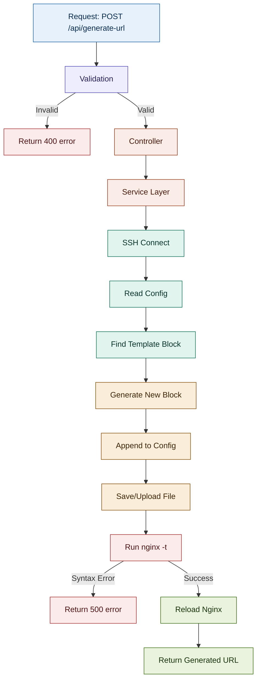
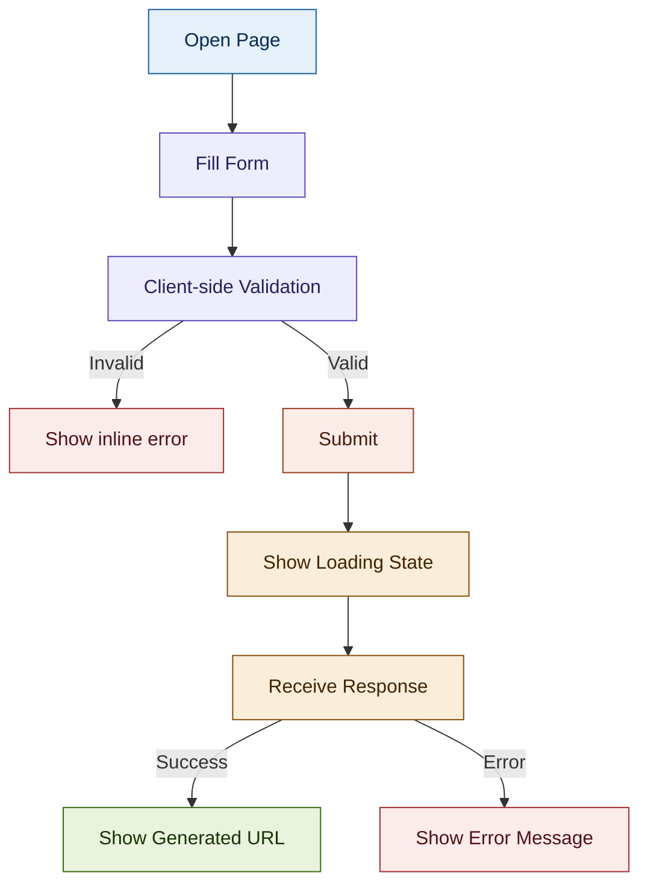

# Nginx Location Automation — Complete Project Guide

---

## 1. Project Overview

### The problem

Every time a new client/company needs a video demo page, an engineer has to manually:
- SSH into the server
- Open the Nginx config in `nano`
- Copy an existing `location` block
- Manually rename the URL path
- Save, check syntax, reload Nginx

This is repetitive, error-prone (typos in paths break the site), and requires Linux/Nginx knowledge from whoever is doing it — even if it's a non-technical team member requesting a new demo link.

### Existing manual workflow

```
Engineer → SSH into server → nano config file → manually copy/paste block →
manually edit path → save → nginx -t → systemctl reload nginx
```

Every step here is manual, and every step can go wrong (wrong path, broken syntax, forgetting to reload).

### Automated workflow

```
User fills form (Name, Company, Video) → clicks Submit →
Backend does everything the engineer used to do, automatically →
User instantly gets back a working URL
```

### Real-world use case

A sales/marketing team wants to send a personalized demo link to a client (e.g. "ABC Pharma") without needing an engineer involved. They open a simple form, pick the video, type the name and company, and get a ready-to-share URL like:

```
https://yourdomain.com/rahul/abc-pharma/wazzuppapdemo
```

### Expected final result

- A web form (Name, Company, Video dropdown, Submit)
- A backend that connects to the Linux server over SSH
- The backend safely creates a **new** Nginx location block (never touching the original template)
- Nginx is validated and reloaded automatically
- The new personalized URL is displayed to the user immediately

---

## 2. Engineering Architecture



| Layer | Responsibility |
|---|---|
| **User** | Fills the form with their name, company, and desired video |
| **Frontend** | Collects input, validates it client-side, sends it to the backend API, and displays the final result (URL or error) |
| **Backend** | Validates input server-side, builds the correct Nginx block text, orchestrates the SSH connection, and returns a clean response |
| **SSH Layer** | The secure channel used to remotely read and write files on the Linux server, and to run shell commands (`nginx -t`, `systemctl reload nginx`) |
| **Linux Server** | Hosts the actual Nginx config files (`/etc/nginx/sites-available/...`) and runs the Nginx process |
| **Nginx** | Serves the videos, and after reload, serves the new personalized URL |

**Why this separation matters:** each layer only knows about the layer directly next to it. The frontend never talks to SSH directly, and the backend never talks to the browser's DOM. This keeps each part independently testable and replaceable (e.g. you could swap the frontend for a mobile app later without touching the SSH logic at all).

---

## 3. Linux Command Guide (Text Only)

| Command | Purpose | When used | Why used | Expected output |
|---|---|---|---|---|
| `ssh user@host` | Opens a secure remote shell/connection to the Linux server | At the very start, before touching any file | Nginx config lives on a remote server, not on the backend's own machine | Remote shell prompt, or (in our case) a connected SSH session object in code |
| `cd /path` | Changes current directory | Before reading/writing a specific config file | Config files live in a specific folder (`/etc/nginx/sites-available/`) | Prompt path changes; no output on success |
| `cat filename` | Prints file contents to the screen | To read the existing Nginx config before editing it | We need to see the current template block to copy its structure | Full text content of the file |
| `nano filename` | Opens a file in a terminal text editor | **Only for manual/human editing** — this project explicitly avoids automating it | Automating a text editor UI is fragile and risky (editors are built for humans, not scripts) | An interactive editing screen (not something a script should drive) |
| `sudo command` | Runs a command with administrator/root privileges | Whenever changing system-level files or restarting services | Nginx config and its service control are protected — normal users can't touch them | Command runs as root; may prompt for password if not configured with keys |
| `sudo nginx -t` | Tests Nginx configuration syntax without applying it | Immediately after writing the new config, before reloading | Catching a syntax error *before* reloading prevents taking the whole site down | `nginx: configuration file /etc/nginx/nginx.conf test is successful` (or an error with the exact line number) |
| `sudo systemctl reload nginx` | Reloads Nginx with the new config, without dropping active connections | Only after `nginx -t` passes | A full restart would briefly interrupt all live traffic; reload applies changes gracefully | No output on success (silent success is normal for systemctl) |
| `sites-available/` | Folder holding all possible Nginx site configs (whether active or not) | Referenced when reading/writing the config file | This is the "master copy" location — the safe place to edit configs | A directory listing of config files |
| `sites-enabled/` | Folder holding symlinks to the configs that are actually active | Not directly touched in this project, but good to know | Nginx only loads what's inside `sites-enabled/`; `sites-available/` alone does nothing until linked | A directory listing of symlinks pointing back into `sites-available/` |
| `alias` (Nginx directive) | Maps a URL path to a real folder path on disk | Inside each `location` block, e.g. `alias /var/www/Videos/Wazzuppap;` | Tells Nginx exactly where the actual video files live for that URL | Not a shell command — it's config syntax; "output" is that Nginx serves files from that folder for that path |
| `location` (Nginx directive) | Defines a URL path block and how Nginx should handle requests to it | Every new personalized link is a new `location` block | This is literally what our automation is generating — one new block per submission | Not a shell command — config syntax; "output" is a new working URL |
| `access_log` (Nginx directive) | Tells Nginx where to write request logs for that specific location | Inside each `location` block, one unique log path per client | Keeps each client's access logs separate and easy to trace later | A growing log file at the given path, one line per request |

---

## 4. Backend Engineering Guide

### Folder structure

```
backend/
├── src/
│   ├── routes/
│   │   └── generateUrl.routes.js
│   ├── controllers/
│   │   └── generateUrl.controller.js
│   ├── services/
│   │   ├── ssh.service.js
│   │   └── nginx.service.js
│   ├── utils/
│   │   ├── slugify.util.js
│   │   └── configParser.util.js
│   ├── validators/
│   │   └── generateUrl.validator.js
│   └── app.js
├── .env
├── package.json
└── server.js
```

### Package purpose

| Package | Why it's used |
|---|---|
| `express` | The web framework — handles routing, requests, and responses |
| `ssh2` | A Node.js SSH client — lets the backend connect to the Linux server, run shell commands, and read/write remote files, all without a human typing into a terminal |
| `dotenv` | Loads SSH credentials (host, username, private key path) from a `.env` file instead of hardcoding them in source code |
| `fs` (Node built-in) | Used locally to read the SSH private key file from disk before establishing the connection |
| `path` (Node built-in) | Safely builds file paths across operating systems (avoids manual string concatenation bugs) |
| `slugify` | Converts free-text input like "ABC Pharma" into a clean, URL-safe slug like `abc-pharma` (lowercase, no spaces, no special characters) |
| `express-validator` | Validates and sanitizes incoming form data (Name, Company, Video) before any of it touches the SSH/Nginx logic |
| `nodemon` | Development-only tool — automatically restarts the server when code changes, so you don't restart manually every time |

### Request lifecycle through the backend

1. **Route** — receives the `POST /api/generate-url` request and hands it to the validator, then the controller. Its only job is directing traffic.
2. **Validation flow** — checks that Name, Company, and Video are present and well-formed *before* any SSH connection is even opened. Rejecting bad input early avoids wasting an SSH round-trip on a request that was never going to succeed.
3. **Controller flow** — reads the validated request body, calls the service layer, and shapes the final HTTP response (success or error). It contains no SSH or Nginx logic itself — it only orchestrates.
4. **Service flow (SSH)** — opens the SSH connection using credentials from `.env`, and exposes simple functions like "read this file" and "run this command" that the rest of the app can call without knowing SSH internals.
5. **Service flow (Nginx)** — this is where the actual business logic lives: read the config, find the matching template block, generate the new block text, append it, test, and reload.
6. **Parser flow (utility)** — a small focused function whose only job is: given the raw config text and a template identifier, extract that one `location` block as a string, ready to be duplicated and modified.
7. **Nginx update flow** — takes the extracted template block, replaces the old path (`/soumalya/indoco/wazzuppapdemo`) with the new generated path (`/rahul/abc-pharma/wazzuppapdemo`), and appends this *new* block to the config text — the original template block is left completely untouched.
8. **Response flow** — once `nginx -t` passes and reload succeeds, the controller sends back `{ success: true, url: "..." }`. If anything fails at any step (bad input, SSH failure, syntax error), the response instead carries a clear error message and the appropriate HTTP status code.

### Responsibility of every file

| File | Responsibility |
|---|---|
| `generateUrl.routes.js` | Defines the `POST /api/generate-url` endpoint and wires validator → controller |
| `generateUrl.validator.js` | Rejects incomplete/malformed input before it reaches business logic |
| `generateUrl.controller.js` | Coordinates the request: calls services, builds the HTTP response |
| `ssh.service.js` | Owns the SSH connection lifecycle — connect, run command, read file, write file, disconnect |
| `nginx.service.js` | Owns the actual automation logic — find template, generate block, save config, test, reload |
| `slugify.util.js` | Turns "Rahul", "ABC Pharma" into URL-safe path segments |
| `configParser.util.js` | Extracts a specific `location` block from the full config text |
| `app.js` | Sets up Express, middleware, and mounts routes |
| `server.js` | Starts the HTTP server and loads environment variables |

---

## 5. Frontend Engineering Guide

### Folder structure

```
frontend/
├── index.html
├── css/
│   └── style.css
├── js/
│   ├── api.js
│   └── form.js
└── assets/
    └── logo.png
```

*(If using React instead of plain HTML — replace `js/` and `index.html` with a standard Create React App / Vite structure: `src/components/`, `src/api/`, `src/App.jsx`. The responsibilities below stay identical either way.)*

### What each piece does

| Piece | Responsibility |
|---|---|
| **HTML structure** | Defines the form: Name input, Company input, Video dropdown, Submit button, and a result/message area |
| **Bootstrap** | Provides ready-made, responsive styling for the form and buttons without writing custom CSS from scratch |
| **JavaScript (form.js)** | Listens for form submit, runs client-side validation, and triggers the API call |
| **Fetch API** | Sends the `POST` request to `/api/generate-url` with the form data as JSON, and receives the backend's response |
| **Form validation** | Ensures Name and Company aren't empty and a video is actually selected, *before* even calling the API — saves a wasted network round trip |
| **Dropdown mapping** | Each dropdown option's value maps to a specific template identifier the backend recognizes (e.g. `"Wazzuppap Demo"` → `wazzuppapdemo`) |
| **API communication** | All fetch logic lives in one file (`api.js`) so the rest of the frontend doesn't need to know request/response details |
| **Loading state** | While waiting for the backend (SSH + Nginx reload takes a few seconds), the button is disabled and a spinner/message is shown so the user knows it's working |
| **Success page/state** | Displays the generated URL clearly, ideally with a "copy link" button |
| **Error page/state** | Displays a clear, non-technical message if anything failed (e.g. "Couldn't generate your link — please try again" rather than a raw stack trace) |

---

## 6. Backend Flowchart



---

## 7. Frontend Flowchart



---

## 8. Folder Structure (Production-Ready)

```
project-root/
├── backend/
│   ├── src/
│   │   ├── routes/          # API endpoint definitions only
│   │   ├── controllers/     # Request/response orchestration
│   │   ├── services/        # SSH + Nginx business logic
│   │   ├── utils/           # Small reusable helpers (slugify, parser)
│   │   ├── validators/      # Input validation rules
│   │   ├── middleware/      # Error handling, request logging
│   │   └── app.js
│   ├── .env                 # SSH host, username, key path — never committed
│   ├── .env.example         # Template showing required variables, safe to commit
│   ├── package.json
│   └── server.js
│
├── frontend/
│   ├── index.html
│   ├── css/
│   ├── js/
│   └── assets/
│
├── docs/
│   └── this-guide.md
│
└── README.md
```

| Folder | Explanation |
|---|---|
| `routes/` | Pure traffic direction — no logic |
| `controllers/` | Coordinates services, builds HTTP responses |
| `services/` | All the real work: SSH handling, Nginx block generation |
| `utils/` | Small, single-purpose, reusable functions |
| `validators/` | Keeps bad input from ever reaching SSH/Nginx logic |
| `middleware/` | Centralized error handling and logging, shared across all routes |
| `.env` / `.env.example` | Keeps secrets out of source code while documenting what's needed |
| `docs/` | Keeps project documentation alongside the code |

---

## 9. Complete API Flow

```
Browser (form submit)
    ↓  fetch POST /api/generate-url  { name, company, video }
Express (routes layer)
    ↓  validated request
Controller
    ↓  calls service with clean input
Service (business logic)
    ↓  opens SSH session
SSH (ssh2)
    ↓  runs remote commands / reads & writes files
Linux Server
    ↓  filesystem + shell access
Nginx
    ↓  config tested, reloaded
Response
    ↓  { success: true, url: "https://.../rahul/abc-pharma/wazzuppapdemo" }
Browser (displays result)
```

Each arrow above is a **trust boundary** — the layer below never assumes the layer above did its job correctly, which is why validation happens before the controller, and `nginx -t` happens before reload.

---

## 10. Development Roadmap

### Phase 1 — Foundations
**Goal:** Get comfortable with the core technologies in isolation, before combining them.
**Topics:** Node.js basics, Express routing, `.env` files, basic HTML forms, Bootstrap.
**Expected outcome:** A simple Express server that returns a JSON response to a form submission — no SSH or Nginx yet.

### Phase 2 — SSH Integration
**Goal:** Learn to control a remote server from code.
**Topics:** `ssh2` package, SSH key authentication, running remote commands, reading remote files programmatically.
**Expected outcome:** Backend can connect to the Linux server and print the contents of the Nginx config file to your own console.

### Phase 3 — Config Parsing & Generation
**Goal:** Safely manipulate Nginx config as plain text.
**Topics:** String parsing, regex or line-based extraction, `slugify`, building new config blocks without touching existing ones.
**Expected outcome:** Given sample input, the backend can generate a correct new `location` block as a string (not yet saved to the server).

### Phase 4 — Full Automation Loop
**Goal:** Connect parsing + SSH + Nginx lifecycle commands into one working flow.
**Topics:** Uploading modified config back over SSH, running `nginx -t`, conditionally running `systemctl reload nginx`, handling failures at each step.
**Expected outcome:** Submitting the form actually creates a new working URL on the real server.

### Phase 5 — Frontend Polish
**Goal:** Make the tool genuinely usable by non-technical teammates.
**Topics:** Loading states, clear success/error messaging, form validation, copy-to-clipboard for the generated URL.
**Expected outcome:** A clean, forgiving UI that a non-engineer could use without guidance.

### Phase 6 — Hardening
**Goal:** Make it production-safe.
**Topics:** Input sanitization, error logging, rate limiting, backup of config before every write.
**Expected outcome:** The tool can't be used to inject malicious paths or corrupt the Nginx config, even with hostile input.

### Final Deployment
**Goal:** Ship it.
**Topics:** Environment variables for production, process manager (e.g. `pm2`), HTTPS termination, monitoring.
**Expected outcome:** The tool runs reliably as a background service, accessible to your team.

---

## 11. Best Practices

| Area | Practice |
|---|---|
| **Security** | Never hardcode SSH credentials — always load from `.env`. Use SSH key-based auth, not passwords. Restrict the SSH user's permissions to only what's needed (reading/writing that one config path, running only `nginx -t` and `systemctl reload nginx`). |
| **Error Handling** | Every step (SSH connect, file read, file write, `nginx -t`, reload) should have its own try/catch with a specific, human-readable error message — a failure in one step shouldn't crash the whole process silently. |
| **Validation** | Validate on both frontend (fast feedback) *and* backend (real security boundary — never trust the client alone). |
| **Logging** | Log every generated URL, timestamp, and which template it was based on — this becomes your audit trail when debugging "why did this URL break." |
| **Scalability** | Keep SSH connections short-lived (connect, do the work, disconnect) rather than one long-lived connection — easier to reason about and recover from failures. |
| **Performance** | Config file reads/writes are the slow part (network + disk) — avoid re-reading the whole config more than once per request. |
| **Maintainability** | Keep the "find template" and "generate new block" logic as small, separately testable functions — this is the part most likely to need tweaking as templates evolve. |

---

## 12. Future Improvements

| Improvement | Why it helps |
|---|---|
| **Authentication** | Restrict who can generate URLs — right now anyone with access to the form can create Nginx blocks |
| **Database** | Store every generated URL with its metadata (name, company, video, timestamp) instead of relying only on log files |
| **Audit Logs** | A dedicated, queryable log of every config change, separate from Nginx's own access logs |
| **History / Dashboard** | A page listing all previously generated links, searchable by company name |
| **Multiple Servers** | Support generating the same kind of URL across more than one Linux/Nginx server |
| **Docker** | Containerize the backend for consistent deployment across environments |
| **CI/CD** | Automatically test and deploy backend changes instead of manually restarting the service |
| **HTTPS** | Ensure the generated URLs and the admin form itself are always served over HTTPS |